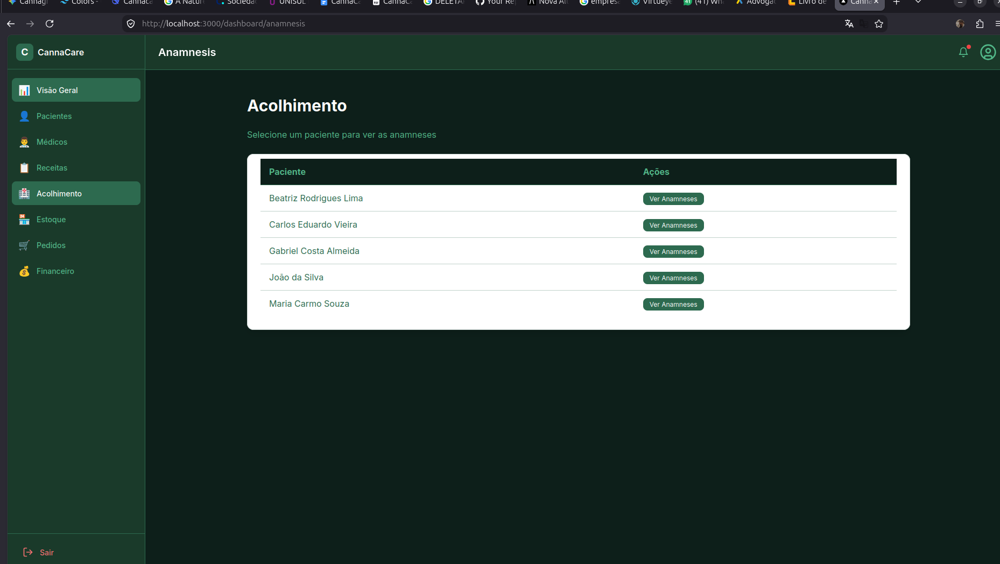

## tecnoloigas que vamos usar.

* **Next.js 14 (App Router):** Framework React com roteamento
* **React:** Interfaces e estado
* **TypeScript:** Tipagem estática
* **Tailwind CSS:** Estilização rápida
* **React Hook Form + Zod:** Formulários e validação
* **Axios:** Chamadas à API

Vantagens Desta Abordagem:

    ✅ Menos dependências (não vamos usar Shadcn)

    ✅ Componentes próprios (total controle)

    ✅ Mais rápido de desenvolver

    ✅ Mais fácil de entender e modificar

    📁 ESTRUTURA SIMPLIFICADA DO FRONTEND  


``` 
## 🌿 LISTA DE BRANCHES DO FRONTEND
# 🌿 Cronograma de Desenvolvimento Front-end & Mapeamento de Branches

Abaixo encontra-se a estrutura de ramificação do Git mapeada para cada módulo do sistema e os respetivos endpoints consumidos da API em Go.

* **Etapa 1: `frontend-etapa-01-boas-vindas`**
  * **Módulo:** Página Inicial
  * **Endpoints:** Nenhum (página pública de apresentação)

* **Etapa 2: `frontend-etapa-02-login`**
  * **Módulo:** Autenticação
  * **Endpoints:** `POST /api/auth/login`, `POST /api/auth/register`

* **Etapa 3: `frontend-etapa-03-dashboard`**
  * **Módulo:** Dashboard
  * **Endpoints:** `GET /api/dashboard/overview`

* **Etapa 4: `frontend-etapa-04-pacientes`**
  * **Módulo:** Pacientes
  * **Endpoints:** `POST/GET/PUT/DELETE /api/patients`, `PATCH /api/patients/{id}/status`

* **Etapa 5: `frontend-etapa-05-medicos`**
  * **Módulo:** Médicos
  * **Endpoints:** `POST/GET/PUT/DELETE /api/doctors`, `GET /api/doctors/top`

* **Etapa 6: `frontend-etapa-06-documentos`**
  * **Módulo:** Documentos
  * **Endpoints:** `POST/GET /api/patients/{id}/documents`, `PATCH /api/documents/{id}/status`

* **Etapa 7: `frontend-etapa-07-receitas`**
  * **Módulo:** Receitas
  * **Endpoints:** `POST/GET/PUT/DELETE /api/prescriptions`, `GET /api/prescriptions/validate/{id}`

* **Etapa 8: `frontend-etapa-08-anamnese`**
  * **Módulo:** Acolhimento
  * **Endpoints:** `POST/GET/PUT/DELETE /api/patients/{id}/anamnesis`

* **Etapa 9: `frontend-etapa-09-produtos`**
  * **Módulo:** Produtos
  * **Endpoints:** `POST/GET/PUT/DELETE /api/products`, `GET /api/products/low-stock`

* **Etapa 10: `frontend-etapa-10-estoque`**
  * **Módulo:** Estoque
  * **Endpoints:** `POST/GET /api/stock/lots`, `POST /api/stock/adjust`, `GET /api/stock/movements`

* **Etapa 11: `frontend-etapa-11-pedidos`**
  * **Módulo:** Pedidos
  * **Endpoints:** `POST/GET/PATCH /api/orders`, `PATCH /api/orders/{id}/status`, `POST /api/orders/{id}/label`

* **Etapa 12: `frontend-etapa-12-financeiro`**
  * **Módulo:** Financeiro
  * **Endpoints:** `POST/GET /api/financial/subscriptions`, `POST/GET/PATCH /api/financial/payments`

* **Etapa 13: `frontend-etapa-13-relatorios`**
  * **Módulo:** Relatórios
  * **Endpoints:** `GET /api/dashboard/patients`, `GET /api/dashboard/expired-prescriptions`

* **Etapa 14: `frontend-etapa-14-perfil`**
  * **Módulo:** Perfil
  * **Endpoints:** `GET/PUT /api/users/me`

* **Etapa 15: `frontend-etapa-15-deploy`**
  * **Módulo:** Deploy
  * **Endpoints:** N/A (Configurações de ambiente de produção e CI/CD)


## Etapa 7: gestão de receita


Objetivo desta etapa:
 xxxxxxxxx

## 📁 ESTRUTURA DE PASTAS DA ETAPA 9


``` bash

app/dashboard/products/
└── page.tsx                    # Lista de produtos + formulário


``` 

## ✅ O QUE ESTA PÁGINA FAZ

### 📦 Funcionalidades do Módulo de Produtos

| Funcionalidade | Descrição |
| :--- | :--- |
| **📋 Lista produtos** | Mostra todos os produtos e óleos cadastrados no sistema |
| **➕ Cadastrar** | Formulário dinâmico para a adição de um novo produto ao catálogo |
| **✏️ Editar** | Permite a alteração dos dados cadastrais e especificações do produto |
| **🔄 Ativar/Desativar** | Altera a disponibilidade e o status ativo do produto na plataforma |
| **⚠️ Estoque baixo** | Alerta visual automático quando a quantidade do produto atinge o limite mínimo |

## 🎯 PÁGINA PRINCIPAL: /dashboard/products

```bash
┌────────────────────────────────────────────────────────────────────────────┐
│                         PÁGINA DE PRODUTOS                                 │
├────────────────────────────────────────────────────────────────────────────┤
│                                                                            │
│  ┌─────────────────────────────────────────────────────────────────────┐   │
│  │  Cabeçalho                                                          │   │
│  │  "Produtos - Gerencie o catálogo de produtos"                       │   │
│  │  [+ Novo Produto]  ← Botão para abrir o formulário                  │   │
│  └─────────────────────────────────────────────────────────────────────┘   │
│                                                                            │
│  ┌─────────────────────────────────────────────────────────────────────┐   │
│  │  ⚠️ ALERTA DE ESTOQUE BAIXO (se houver)                             │   │
│  │  Produtos com quantidade abaixo do mínimo definido                  │   │
│  └─────────────────────────────────────────────────────────────────────┘   │
│                                                                            │
│  ┌─────────────────────────────────────────────────────────────────────┐   │
│  │  FORMULÁRIO DE PRODUTO (aparece ao clicar em "+ Novo Produto")      │   │
│  │                                                                     │   │
│  │  Nome: [___________]                                                │   │
│  │  Descrição: [___________]                                           │   │
│  │  Preço: [_________]  Estoque Mínimo: [_________]                    │   │
│  │                                                                     │   │
│  │  [Cadastrar]  [Cancelar]                                            │   │
│  └─────────────────────────────────────────────────────────────────────┘   │
│                                                                            │
│  ┌─────────────────────────────────────────────────────────────────────┐   │
│  │  TABELA DE PRODUTOS                                                 │   │
│  │                                                                     │   │
│  │  Nome         │ Preço    │ Estoque Mínimo │ Status   │ Ações        │   │
│  │  ──────────── │ ──────── │ ───────────── │ ──────── │ ───────────   │   │
│  │  Óleo CBD 10% │ R$ 150,00│ 10            │ Ativo    │ [Editar]      │   │
│  │  Óleo CBD 20% │ R$ 250,00│ 5             │ Ativo    │ [Editar]      │   │
│  │  Cápsulas CBD │ R$ 80,00 │ 20            │ Inativo  │ [Editar]      │   │
│  └─────────────────────────────────────────────────────────────────────┘   │
└────────────────────────────────────────────────────────────────────────────┘

``` 

Resultado:
