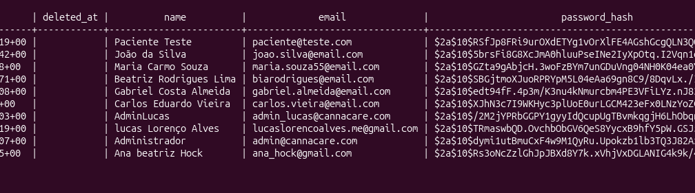

## 📋 CHECKLIST DE VALIDAÇÃO DO SISTEMA 

Vamos verificar todos os módulos e funcionalidades:

## 1. 🔐 AUTENTICAÇÃO

| Item | O que testar | Status |
| :--- | :--- | :---: |
| **Login** | Fazer login com `admin@cannacare.com` / `admin123` | ✅ |
| **Registro** | Criar um novo usuário | ✅ |
| **Logout** | Clicar em "Sair" no menu | ✅ |
| **Proteção** | Tentar acessar `/dashboard` sem login | ✅ |

---

Resultado:
Registro:
- Ana Beatriz Hock
- ana_hock@acf_association.me
- Can2026!@#

Resultado: 



## 2. 📊 DASHBOARD

| Item | O que testar | Status |
| :--- | :--- | :---: |
| **Cards** | Estão mostrando números do banco? | ⬜ |
| **Fila Regulatória** | Lista pacientes pendentes? | ⬜ |
| **Ações Rápidas** | Botões funcionam? | ⬜ |

---

Endpoint: /api/dashboard/patients
Tabela principal: patients
O que verificar:
```bash
-- Total de pacientes
SELECT COUNT(*) FROM patients;

-- Pacientes por status
SELECT status, COUNT(*) as total 
FROM patients 
WHERE deleted_at IS NULL 
GROUP BY status;

-- Pacientes sociais
SELECT COUNT(*) FROM patients WHERE is_social_patient = true;

-- Novos pacientes no mês
SELECT COUNT(*) FROM patients 
WHERE created_at >= date_trunc('month', CURRENT_DATE);
```

## 3. 👤 PACIENTES

| Item | O que testar | Status |
| :--- | :--- | :---: |
| **Lista** | Mostra todos os pacientes? | ⬜ |
| **Aprovar** | Botão "Aprovar" funciona? | ⬜ |
| **Rejeitar** | Botão "Rejeitar" funciona? | ⬜ |
| **Detalhes** | Clicar no paciente abre a página de detalhes? | ⬜ |
| **Documentos** | Upload de documento funciona? | ⬜ |

---

## 4. 👨‍⚕️ MÉDICOS

| Item | O que testar | Status |
| :--- | :--- | :---: |
| **Lista** | Mostra todos os médicos? | ⬜ |
| **Cadastrar** | "+ Novo Médico" funciona? | ⬜ |
| **Editar** | Botão "Editar" funciona? | ⬜ |
| **Ativar/Desativar** | Botão funciona? | ⬜ |

---

## 5. 📋 RECEITAS

| Item | O que testar | Status |
| :--- | :--- | :---: |
| **Lista** | Mostra todas as receitas? | ⬜ |
| **Validar** | Botão "Validar" funciona? | ⬜ |
| **Status** | Cores dos status estão corretas? | ⬜ |

---

## 6. 🏥 ACOLHIMENTO (ANAMNESE)

| Item | O que testar | Status |
| :--- | :--- | :---: |
| **Lista** | Mostra pacientes com anamneses? | ⬜ |
| **Nova Anamnese** | Formulário funciona? | ⬜ |
| **Rastreios** | Tipos diferentes funcionam? | ⬜ |

---

## 7. 📦 PRODUTOS

| Item | O que testar | Status |
| :--- | :--- | :---: |
| **Lista** | Mostra todos os produtos? | ⬜ |
| **Cadastrar** | "+ Novo Produto" funciona? | ⬜ |
| **Editar** | Botão "Editar" funciona? | ⬜ |
| **Ativar/Desativar** | Botão funciona? | ⬜ |
| **Estoque Baixo** | Alerta aparece quando necessário? | ⬜ |

---

## 8. 🏪 ESTOQUE

| Item | O que testar | Status |
| :--- | :--- | :---: |
| **Visão Geral** | Cards mostram dados? | ⬜ |
| **Lotes** | Lista de lotes aparece? | ⬜ |
| **Entrada** | "+ Entrada de Produto" funciona? | ⬜ |
| **Movimentações** | Histórico aparece? | ⬜ |

---

## 9. 🛒 PEDIDOS

| Item | O que testar | Status |
| :--- | :--- | :---: |
| **Lista** | Mostra todos os pedidos? | ⬜ |
| **Criar** | "+ Novo Pedido" funciona? | ⬜ |
| **Status** | Avançar status funciona? | ⬜ |
| **Detalhes** | Clicar no pedido abre detalhes? | ⬜ |

---

## 10. 💰 FINANCEIRO

| Item | O que testar | Status |
| :--- | :--- | :---: |
| **Visão Geral** | Cards mostram dados? | ⬜ |
| **Anuidades** | Lista + criar funciona? | ⬜ |
| **Pagamentos** | Lista + criar + confirmar funciona? | ⬜ |

---

## 11. 📈 RELATÓRIOS

| Item | O que testar | Status |
| :--- | :--- | :---: |
| **Pacientes** | Relatório carrega? | ⬜ |
| **Receitas Vencidas** | Lista aparece? | ⬜ |
| **Top Médicos** | Ranking aparece? | ⬜ |
| **Estoque Baixo** | Alerta aparece? | ⬜ |

---

## 12. 👤 PERFIL

| Item | O que testar | Status |
| :--- | :--- | :---: |
| **Visualizar** | Dados aparecem? | ⬜ |
| **Editar** | Editar perfil funciona? | ⬜ |
| **Alterar Senha** | Troca de senha funciona? | ⬜ |
Vamos verificar todos os módulos e funcionalidades:  


